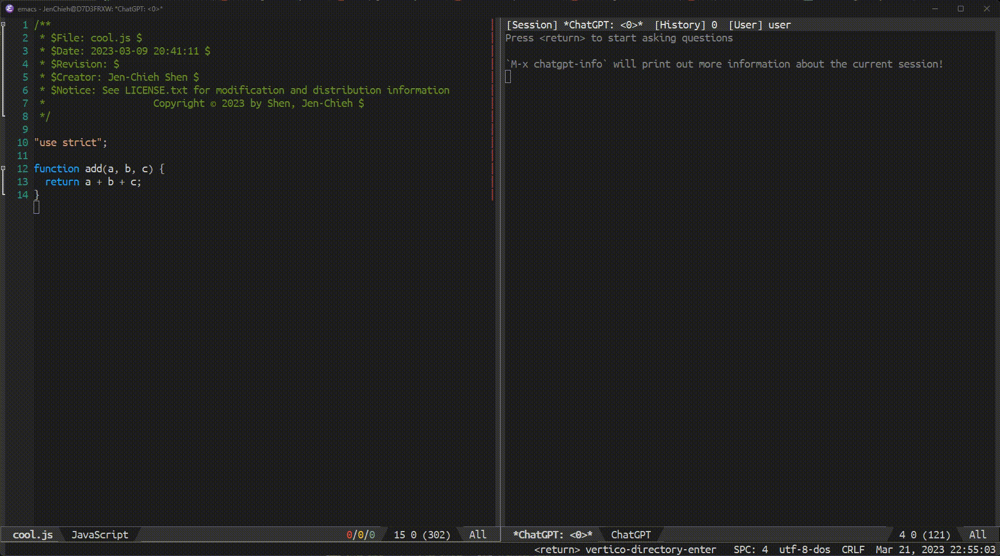

<picture>
  <source media="(prefers-color-scheme: light)" srcset="https://raw.githubusercontent.com/emacs-openai/openai/master/etc/light">
  <source media="(prefers-color-scheme: dark)" srcset="https://raw.githubusercontent.com/emacs-openai/openai/master/etc/dark.png">
  
</picture>

[](https://www.gnu.org/licenses/gpl-3.0)
[](https://jcs-emacs.github.io/jcs-elpa/#/chatgpt)

# chatgpt
> Use ChatGPT inside Emacs

[](https://github.com/emacs-openai/chatgpt/actions/workflows/test.yml)

This Emacs Code extension allows you to use the official OpenAI API to generate
code or natural language responses from OpenAI's [ChatGPT](https://openai.com/blog/chatgpt)
to your questions, right within the editor.

*P.S. This plugin focuses on experience with making conversations with ChatGPT!*

<p align="center">

</p>

## 💾 Installation

#### package.el

This package is available from [JCS-ELPA](https://jcs-emacs.github.io/jcs-elpa/).
Install from these repositories then you should be good to go!

Normally, you don't need to add `(require 'chatgpt)` to your configuration since
most `'chatgpt` commands are autoload and can be called without loading the module!

#### use-package

If you are using [use-package](https://www.emacswiki.org/emacs/UsePackage),
add the following to your `init.el` file:

```elisp
(use-package chatgpt :ensure t)
```

or with `straight.el`:

```elisp
(use-package chatgpt
  :straight (chatgpt :type git :host github :repo "emacs-openai/chatgpt"))
```

#### Manual installation

Copy all `.el` files in this repository to `~/.emacs.d/lisp` and add the following:

```elisp
(add-to-list 'load-path "~/.emacs.d/lisp/")
(require 'chatgpt)
```

## 🔑 Obtaining API key

To use this extension, you will need an API key from OpenAI. To obtain one,
follow these steps:

1. Go to [OpenAI's website](https://beta.openai.com/account/api-keys). If you
don't have an account, you will need to create one or sign up using your Google
or Microsoft account.
2. Click on the `Create new secret key` button.
3. Copy the key and paste into the 'API Key' field under the 'openai' custom group settings.

When you create a new account, you receive $18 in free credits for the API which
you must use in the first 90 days. You can see pricing information
[here](https://openai.com/api/pricing/). 1000 tokens are about 700 words, and
you can see the token count for each request at the end of the response in the
sidebar.

## 🔨 Usage

Before you can use this package you will need to [set up your API key](https://github.com/emacs-openai/openai#-usage) for openai library.

To start this package:

```
M-x chatgpt
```

You will then be asked to insert your response; in this window, you press
<kbd>return</kbd> to send the message, and <kbd>Shift</kbd>+<kbd>return</kbd>
to insert a newline like a normal browser!

## 📝 Customization

#### 🧪 Variables

- `chatgpt-model` - ID of the model to use. (Default: `"gpt-3.5-turbo"`)
- `chatgpt-max-tokens` - The maximum number of tokens to generate in the completion. (Default: `2000`)
- `chatgpt-temperature` - What sampling temperature to use. (Default: `1.0`)
- `chatgpt-input-method` - The method to receive input. (Default: `'window`)
- `chatgpt-display-method` - The method to display buffer. (Default: `nil`)
- `chatgpt-spinner-type` - Type of the spinner. (Default: `'moon`)
- `chatgpt-display-tokens-info` - Non-nil we display tokens information for each request. (Default: `t`)
- `chatgpt-animate-text` - Display text gradually instead of output it all at once. (Default: `t`)
- `chatgpt-animate-fps` - Frame per seconds to display text animation. (Default: `5`)

## 🔗 References

- [ChatGPT.el](https://github.com/joshcho/ChatGPT.el)
- [gptel](https://github.com/karthink/gptel)

## 🛠️ Contribute

[](http://makeapullrequest.com)
[](https://github.com/bbatsov/emacs-lisp-style-guide)
[](https://www.paypal.me/jcs090218)
[](https://www.patreon.com/jcs090218)

If you would like to contribute to this project, you may either
clone and make pull requests to this repository. Or you can
clone the project and establish your own branch of this tool.
Any methods are welcome!

### 🔬 Development

To run the test locally, you will need the following tools:

- [Eask](https://emacs-eask.github.io/)
- [Make](https://www.gnu.org/software/make/) (optional)

Install all dependencies and development dependencies:

```sh
$ eask install-deps --dev
```

To test the package's installation:

```sh
$ eask package
$ eask install
```

To test compilation:

```sh
$ eask compile
```

**🪧 The following steps are optional, but we recommend you follow these lint results!**

The built-in `checkdoc` linter:

```sh
$ eask lint checkdoc
```

The standard `package` linter:

```sh
$ eask lint package
```

*📝 P.S. For more information, find the Eask manual at https://emacs-eask.github.io/.*

## ⚜️ License

This program is free software; you can redistribute it and/or modify
it under the terms of the GNU General Public License as published by
the Free Software Foundation, either version 3 of the License, or
(at your option) any later version.

This program is distributed in the hope that it will be useful,
but WITHOUT ANY WARRANTY; without even the implied warranty of
MERCHANTABILITY or FITNESS FOR A PARTICULAR PURPOSE.  See the
GNU General Public License for more details.

You should have received a copy of the GNU General Public License
along with this program.  If not, see <https://www.gnu.org/licenses/>.

See [`LICENSE`](./LICENSE.txt) for details.
